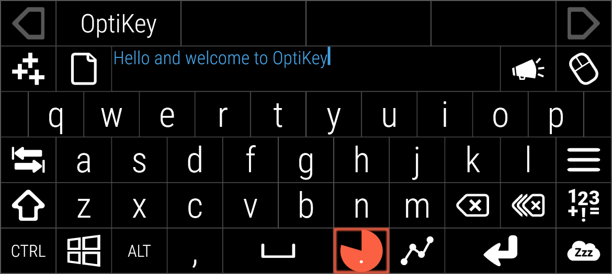
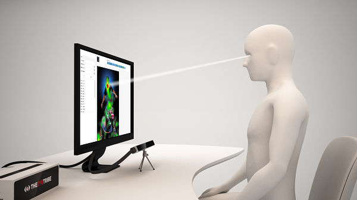
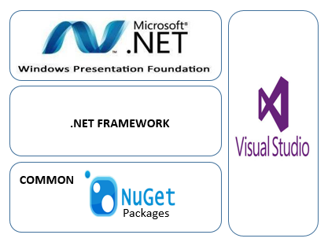
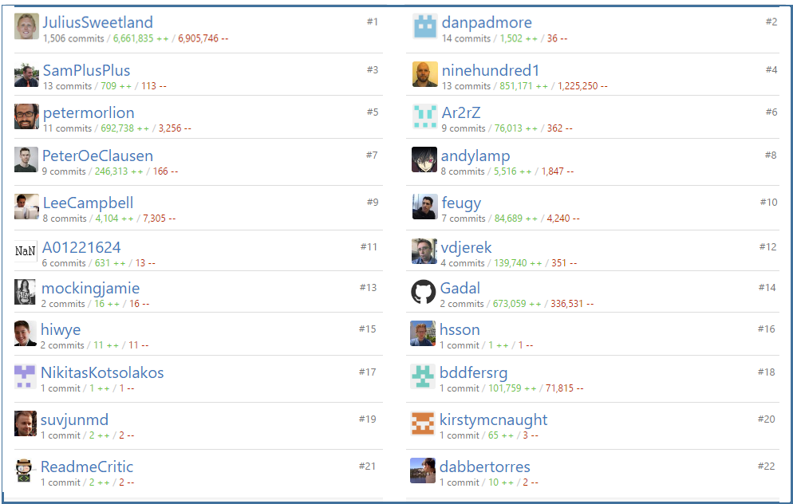
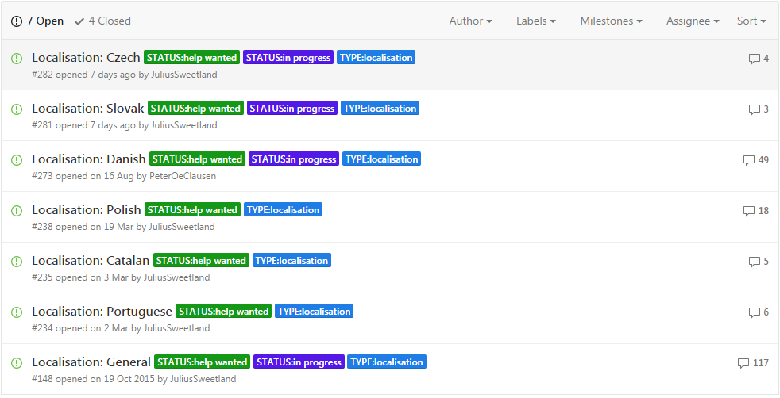

# OptiKey - Full computer control and speech with your eyes

pode ser encontrado em http://www.optikey.org

- [OptiKey - Full computer control and speech with your eyes](#optikey-full-computer-control-and-speech-with-your-eyes)
	- [Descrição](#descrição)
	- [Principais Features](#principais-features)
		- [Compatibilidade](#compatibilidade)
			- [Idiomas](#idiomas)
			- [Dispositivos compatíveis](#dispositivos-compatíveis)
	- [Linguagem de programação](#linguagem-de-programação)
	- [Principais desenvolvedores](#principais-desenvolvedores)
	- [Evolução do sistema](#evolução-do-sistema)
	- [Arquitetura](#arquitetura)
		- [Bibliotecas externas](#bibliotecas-externas)
	- [Contribuições](#contribuições)
	- [Principais padrões de projeto](#principais-padrões-de-projeto)
		- [MVVM](#mvvm)
		- [Observers e Data Binding](#observers-e-data-binding)
	- [Módulos do sistema](#módulos-do-sistema)
		- [Os pacotes disponíveis no repositório do sistema](#os-pacotes-disponíveis-no-repositório-do-sistema)
		- [Dependência entre módulos](#dependência-entre-módulos)
		- [Descrição dos módulos e sua divisão em diretórios](#descrição-dos-módulos-e-sua-divisão-em-diretórios)
	- [Conclusão](#conclusão)

##  Descrição

O sistema OptiKey é um teclado virtual assistivo. Ele foi projetado para ser
utilizado com um dispositivo de rastreamento ocular de baixo custo, com o
intuito de trazer o controle do teclado, controle do mouse e fala para pessoas
com limitações motoras e de fala, como por exemplo pessoas que vivem com Doença
do Neurônio Motor (DNM) e ELA (Esclerose Lateral Amiotrófica).



Tela mostrando o teclado virtual

O OptiKey foi desenvolvido com o objetivo de ser uma alternativa mais barata em
relação aos produtos extremamente caros, difíceis de usar e pouco confiáveis
que existem no mercado de comunicação aumentativa e alternativa (CAA). Por isso
o sistema é de código aberto, livre e gratuito.



Funcionamento utilizando o Rastreamento ocular

##  Principais Features

Com o OptiKey é possível realizar todos os comandos que um teclado normal
realiza. Pode ser usado como uma alternativa ao teclado físico, e utilizado para
digitação em qualquer aplicação. Ele foi desenvolvido para ser utilizado com um
dispositivo de rastreamento ocular, porém pode ser utilizado com um mouse ou
webcam.

Ao digitar, o teclado pode inserir automaticamente espaços entre palavras e
colocar letras maiúsculas para aumentar a velocidade de digitação. Existem
recursos de autocompletar palavras assim como nos aparelhos celulares atuais.


Utilização do OptiKey num editor de texto

Além das teclas do alfabeto comum, existem outras funcionalidades como um
teclado para letras com acento, símbolos de várias moedas, números e símbolos
matemáticos. Para cada idioma, o teclado virtual tem seu leiaute conforme a
padronização.


Funcionalidades e menu do teclado

OptiKey pode ser utilizado para substituir o mouse, permitindo clicar, rolar e
arrastar com precisão em qualquer lugar na tela.


Utilização do OptiKey como um mouse

### Compatibilidade

#### Idiomas

O sistema funciona atualmente com os seguintes idiomas:

- Inglês (Estadunidense, Britânico Canadense)
- Francês
- Alemão
- Russo
- Holandês (com leiaute de teclados da Holanda e da Bélgica)
- Grego
- Turco
- Espanhol
- Croata
- Italiano

#### Dispositivos compatíveis

Como um dos objetivos do sistema era que fosse uma opção de preço mais acessível
para usuários de comunicação aumentativa e alternativa, o desenvolvedor fez
questão de que os dispositivos compatíveis também tivessem preços mais em conta.
Entretanto, dispositivos mais sofisticados também podem ser utilizados para
utilizar o sistema. Segue abaixo a lista dos dispositivos compatíveis:

Opções de baixo custo:

- Tobii EyeX
- Steelseries Sentry Eye Tracker
- TheEyeTribe
- ITU GazeTracker

Outras opções:

- Tobii PCEyeMini
- Tobii REX
- Tobii PCEye Go
- Tobii X2-30
- Tobii X2-60
- EyeTech TM5 mini eye tracker

Todos os dispositivos acima são de rastreamento ocular, porém é possível
utilizar o OptiKey de outras formas, caso o usuário não possua um.

Se o usuário possuir um dispositivo de rastreamento que não for compatível, é
possível simular a utilização de um mouse com o dispositivo e dessa forma
utilizar o OptiKey. E ainda pode ser solicitado para o desenvolvedor a
possibilidade de incluir suporte para esses dispositivos. Além disso, é possível
utilizar o mouse para usar o sistema, ou caso possua uma webcam, a mesma pode
ser configurada para utilizar também.

## Linguagem de programação

A linguagem de programação utilizada para o desenvolvimento do sistema foi C#, e
ainda para várias partes de configuração do sistema foi utilizada a linguagem
específica de domínio XAML.

## Principais desenvolvedores

O sistema foi desenvolvido principalmente por Julius Sweetland sozinho. Do
início do projeto em julho de 2013) até agosto de 2015, apenas o Julius tinha
contribuído para o projeto. Após esse período alguns outros programadores
contribuíram com o desenvolvimento com algumas poucas entregas.

Como a ideia do sistema é que ele fosse utilizado no mundo todo, ele está sendo
adaptado para reconhecer a maior quantidade de idiomas possíveis. E para isso o
desenvolvedor Julius frequentemente solicita ajuda para incluir algum novo
idioma, com ajuda de contribuidores do mundo todo.

## Evolução do sistema

Seguem abaixo os principais releases e algumas novidades de cada versão.

| Versão | Features / Fixes |
|--------|-------------|
| 1.0.0 | - Versão inicial |
| 1.1.0 | - Incluído controle do mouse <br> - Melhorias no código fonte |
| 1.2.0 | - Aumentada quantidade de sugestões de palavras ao escrever <br> - Corrigido bug que travava ao utilizar o recurso de autocompletar <br> - Melhorado o código fonte de ações do mouse |
| 2.0.0 | -Várias novas funcionalidades <br> - Algumas mudanças no design <br> -  Correção de bugs |
|2.1.0 | - Incluído suporte para o idioma Francês(primeiro idioma além do inglês).  <br> - Correção de bugs |
| 2.2.0 | - Incluído suporte para o idioma Alemão. Incluído teclados específicos para os novos idiomas  <br> - Correção de bugs |
| 2.3.0 | Recurso de autocompletar as palavras agora aceita palavras escritas erradas |
|2.3.5 | Versão atual. Incluído suporte para o idioma Italiano |

## Arquitetura

O processo da arquitetura de software objetiva conceber uma visão da organização fundamental do sistema, os seus módulos principais e o relacionamento entre eles e o ambiente. A análise da arquitetura permite relacionar as características do sistema com o os objetivos do cliente.


Visão do contexto

O OptiKey foi desenvolvido em C# na IDE Visual Studio da Microsoft e  maior parte das bibliotecas utilizadas são nativas do C#. Para rodar a aplicação é necessário utilizar um PC ou tablet que possua o .NET 4.6 framework ou superior, o qual está disponível nativamente a partir do Windows Vista.

O .NET framework é uma tecnologia que dá suporte à compilação e à execução de aplicativos e serviços Web. Consiste no Common Language Runtime e na biblioteca de classes .NET Framework. Existe uma gama de bibliotecas disponíveis para manipulação de janelas e dos dos dispositivos de entrada e saída como mouse e teclado que foram utilizadas no desenvolvimento da aplicação.



Ambiente de desenvolvimento

O Windows Presentation Foundation (WPF) é uma estrutura que promove uma interface gráfica para criação de aplicativos desktop. A plataforma de desenvolvimento do WPF oferece suporte a um amplo conjunto de recursos de desenvolvimento de aplicativos, incluindo modelos, recursos, controles, elementos gráficos, layout, associação de dados, documentos e segurança. É um subconjunto do .NET Framework. O WPF usa o XAML (Extensible Application Markup Language) para fornecer um modelo declarativo para o desenvolvimento da aplicação.

### Bibliotecas externas

O OptiKey suporta alguns EyeTrackers e para isso utiliza bibliotecas específicas. Essas bibliotecas possibilitam a integração dos EyeTrackers com a aplicação.


Bibliotecas utilizadas para suporte aos eye trackers

Outra biblioteca utilizada na aplicação é a log4net da Apache, compatível com o .NET Framework, que permite a declaração de registros de logs em diversos destinos de saída.

```C#
using System;
using System.Reactive.Linq;
using System.Reactive.Threading.Tasks;
using System.Threading.Tasks;
using System.Windows;
using log4net;
using TETControls.Calibration;
using JuliusSweetland.OptiKey.Properties;

namespace JuliusSweetland.OptiKey.Services
{
    public class TheEyeTribeCalibrationService : ICalibrationService
    {
        private static readonly ILog Log = LogManager.GetLogger(System.Reflection.MethodBase.GetCurrentMethod().DeclaringType);

        public async Task<string> Calibrate(Window parentWindow)
        {
            Log.Info("Attempting to calibrate using the TheEyeTribe calibration runner.");

         (..)
```

Trecho de código com utilização da biblioteca log4net

## Contribuições

A maior parte da aplicação foi desenvolvida por Julius Sweetland que é o idealizador e principal desenvolvedor. Houveram poucas contribuições por parte de outros programadores, como pode ser observado na imagem de registros de commits do Github.



Ranking de contribuições dos desenvolvedores do OptiKey

Já a inclusão de novos idiomas, é feita com grande ajuda de usuários de diferentes partes do mundo. Para cada idioma que vai ser incluído, o desenvolvedor cria um novo tópico pedindo ajuda de colaboradores para verificação de particularidades de cada língua e também do dicionário utilizado como referência.



Contribuições em progresso de usuários

## Principais padrões de projeto

O OptiKey se aproveita bastante de alguns padrões de projeto e, por isso, vamos aqui explicar os principais que ele utiliza.

### MVVM

O padrão MVVM (Model-View-ViewModel) ajuda o programador a separar as lógicas de negócio e apresentação da sua aplicação da interface do usuário. Utilizando este padrão, a interface do usuário da aplicação e as regras de negócio são separadas em basicamente três tipos de classes:

- View: que encapsula a interface de usuário e sua lógica;
- ViewModel: que encapsula as lógicas e estados da apresentação;
- Model: encapsula as regras de negócio da aplicação e seus dados.

Neste projeto foi utilizada a biblioteca Prism que implementa o padrão MVVM. A biblioteca Prism permite projetar e construir aplicativos flexíveis e de fácil manutenção que são executados no Windows Runtime, WPF (Windows Presentation Foundation), Silverlight ou Windows Phone. Para isso utiliza padrões de projeto que incorporam princípios de design de arquiteturas importantes como a separação de interesses e acoplamento. Dessa forma, os componentes da aplicação podem evoluir de forma independente mas sem perder a possibilidade de serem integrados facilmente à aplicação em geral.

Em resumo, a biblioteca Prism beneficia, principalmente, aplicativos que são construídos para receberem mudanças ao longo do tempo, seja pelo seu longo tempo de vida ou por necessidade de se adequar à novas tecnologias.

Esta biblioteca tem funcionalidades que ajudam a implementar o padrão em aplicações próprias. Tais funcionalidades incorporam as práticas mais comuns de implementação do MVVM e são projetadas para serem testáveis e para serem totalmente compatíveis ao trabalhar com o Visual Studio. A seguinte ilustração contém um esquema do funcionamento do padrão MVVM:


Esquema de funcionamento do MVVM

### Observers e Data Binding

O padrão MVVM fornece uma maneira clara de separação entre a interface com o usuário, as classes de controle  e os dados da aplicação. Neste contexto é muito importante que as classes de Views, ViewModels e Models sejam implementadas de forma que elas consigam interagir facilmente. Uma boa escolha para esse tipo de interação é o uso de Data Bindings e é dessa forma que é implementado no OptiKey.

A biblioteca WPF (Windows Presentation Foundation), já descrita nas sessões anteriores deste documento, provê uma estrutura muito boa para trabalhar com Data Bindings, bastando para isso que as classes que precisem interagir, implementem suas interfaces corretamente.

A WPF fornece diversos modos de Data Binding. Com o one-way data binding, os controles de interface de usuários podem ser atualizados ao serem conectados com uma classe de ViewModel de forma que a interface reflita os valores de dados específicos quando estes mudarem (e a visualização for renderizada). O two-way data binding (vinculação de dados de duas vias), fará com que as classes de ViewModels sejam atualizadas de acordo com modificações na interface do usuário. Talvez a interação mais simples de ser visualizada seja essa entre Views e suas ViewModels (o que não significa que não ocorra em outros contextos).

Todas essas formas de vincular os dados às ações é implementado utilizando-se Observers. Na linguagem C#, as implementações de observers se concentram na interface `INotifyPropertyChanged` e mais informações podem ser vistas aqui: https://msdn.microsoft.com/en-us/library/ms752914.aspx

## Módulos do sistema

### Os pacotes disponíveis no repositório do sistema

No diretório principal do código do projeto, src, encontramos 3 pacotes:

- `JuliusSweetland.OptiKey.AutoCompletePerformance`
- `JuliusSweetland.OptiKey.UnitTests`
- `JuliusSweetland.OptiKey`

Os dois primeiros, são testes automatizados do sistema e o último, a implementação do sistema em si. No stack do Microsoft Visual Studio, os pacotes são separados como Soluções diferentes e as soluções podem ser compiladas e distribuídas independentemente.

Dessa forma, mantendo testes e implementação do sistema em pacotes separados, o projeto principal pode ser compilado para produção sem conter código de testes automatizados que não será utilizado na execução e utilização do mesmo pelos usuários finais.

### Dependência entre módulos

Este é um diagrama de dependência entre os **principais** módulos do sistema:


Diagrama com os principais módulos do sistema

### Descrição dos módulos e sua divisão em diretórios

O código principal da aplicação se encontra no diretório `OptiKey/src/JuliusSweetland.OptiKey/`. Dentro dele, temos a seguinte organização:


| Nome do Diretório | Descrição |
|-------------------|-----------|
| Dictionaries | Contém os arquivos de dicionários disponíveis na aplicação.
| Enums | São os enumeradores da aplicação (conjunto de constantes nomeadas ou listas de numeradores). |
| Extensions | Melhorias implementadas em entidades básicas da aplicação (a aplicação usa uma instância ArrayExtension ao invés de Array, por exemplo). |
| Models  | Classes de dados da aplicação (principais entidades da aplicação). |
| Native | Adaptações para uso de bibliotecas e drivers externos (ex, uso óptico do mouse do sistema). |
| Observables | Implementação das Data Bindings da aplicação (interações entre interface, lógica e dados da aplicação). |
| Properties  | Opções para configurações da aplicação (implementadas em DSL). |
| Resources | São assets utilizados pela aplicação (ícones, fontes, imagens etc). |
| Services | Toda a lógica de negócio da aplicação está implementada em classes de serviços encontradas nesse diretório. |
| Static | Contém classes básicas de instância estática na aplicação (ex. Janela principal da Aplicação). |
| UI | Contém as implementações de toda a interface com o usuário. |

## Conclusão

O OptiKey é um software de simula um teclado virtual assistivo.  Foi projetado para ser utilizado com eye-trackers de baixo custo para dar o controle do mouse, teclado e fala às pessoas com habilidades motoras e de fala limitadas. Um exemplo desse público são os portadores de ELA (Esclerose Lateral Amiotrófica) e MDN (doença do neurônio motor).  Assim o OptiKey foi criado com o objetivo de ser uma alternativa gratuita aos produtos equivalentes já existentes no mercado e que possuem alto custo.

A aplicaçao em si é simples, desenvolvida majoritariamente por um único desenvolvedor e que utiliza as funcionalidades do .Net Framework para o desenvolvimento da maior parte do programa. Algumas tecnologias de padrão de projeto são utilizadas no desenvolvimento como o MVVM (Model-View-ViewModel) e o WPF para o desenvolvimento da interface gráfica.

O usuário que não possui um dispositivo de eye-tracking pode utilizar um mouse. O programa oferece suporte a diversos eye-trackers, em sua maioria de baixo custo, e utiliza bibliotecas dos fabricantes para fazer a integração com o software.

Por se tratar de uma aplicação simples e que utiliza uma diversidade relativamente pequena de tecnologias o tempo de pesquisa sobre o projeto foi destinado, principalmente,  à exploração do código fonte e da arquitetura desenvolvida.
