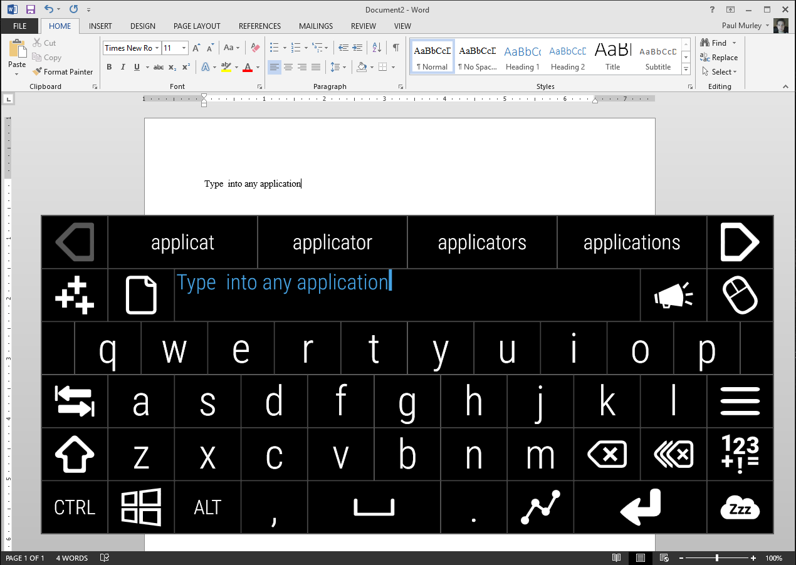
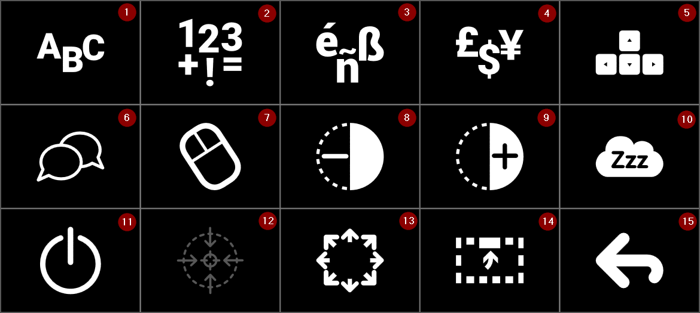
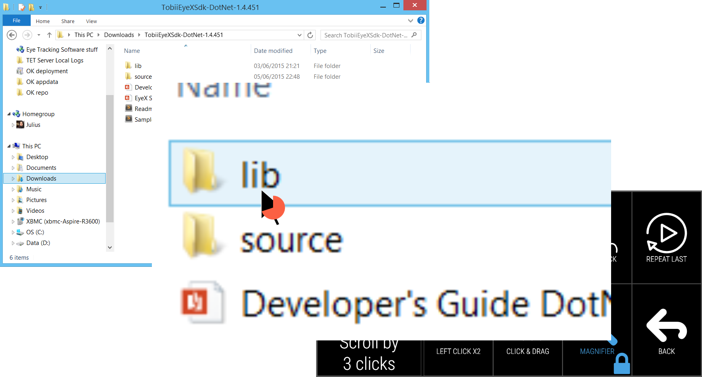
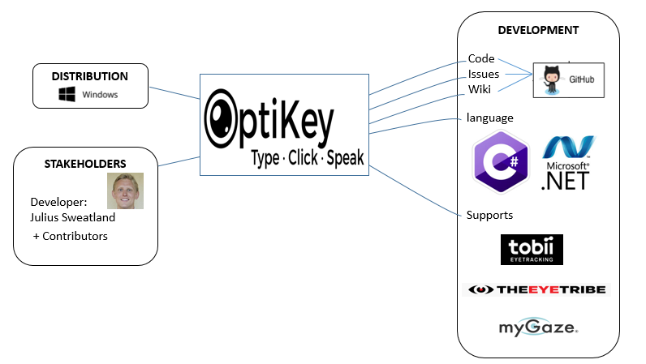
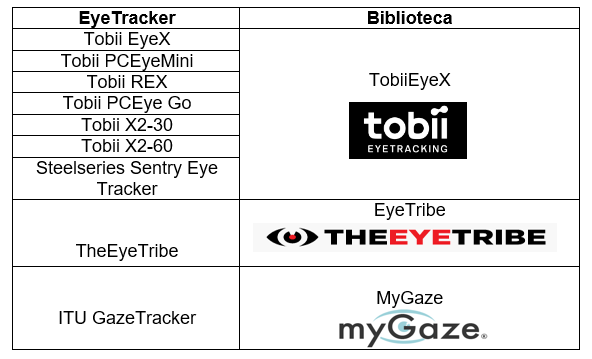
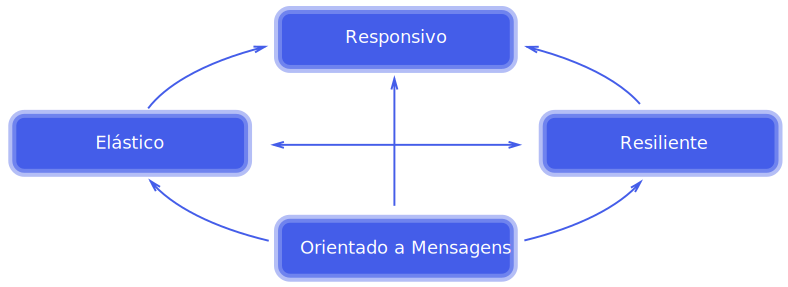

# OptiKey - Full computer control and speech with your eyes

pode ser encontrado em http://www.optikey.org

##  Descrição

O sistema OptiKey é um software que implementa um teclado virtual assistivo.
Foi projetado para ser utilizado com um dispositivo de rastreamento ocular de
baixo custo, com o intuito de trazer o controle do teclado, controle do mouse e
fala para pessoas com limitações motoras e de fala, como por exemplo pessoas que
vivem com Doença do Neurônio Motor (DNM) e ELA (Esclerose Lateral Amiotrófica).

O projeto foi completamente desenvolvido, desde o seu início, usando a linguagem
de programação C# da Microsoft juntamente com seu framework, o .Net (na versão
4.6).


_Tela mostrando o teclado virtual_

O OptiKey foi desenvolvido com o objetivo de ser uma alternativa mais barata em
relação aos produtos extremamente caros, difíceis de usar e pouco confiáveis
que existem no mercado de comunicação aumentativa e alternativa (CAA). Por isso
o sistema é de código aberto, livre e gratuito.


_Funcionamento utilizando o Rastreamento ocular_

##  Principais Features

Com o OptiKey é possível realizar todos os comandos que um teclado normal
realiza. Pode ser usado como uma alternativa ao teclado físico, e utilizado para
digitação em qualquer aplicação. Ele foi desenvolvido para ser utilizado com um
dispositivo de rastreamento ocular, porém pode ser utilizado com um mouse ou
webcam.

Ao digitar, o teclado pode inserir automaticamente espaços entre palavras e
colocar letras maiúsculas para aumentar a velocidade de digitação. Existem
recursos de autocompletar palavras assim como nos aparelhos celulares atuais.




_Utilização do OptiKey num editor de texto_

Além das teclas já existentes em um teclado comum, o OptiKey vem acompanhado de
teclas que proporcionam outras funcionalidades: um teclado para letras com
acento, símbolos de várias moedas, números e símbolos matemáticos. Para cada
idioma suportado o teclado virtual adapta automaticamente o seu leiaute conforme
a padronização.



_Funcionalidades e menu do teclado_

OptiKey pode ser utilizado para substituir o mouse, permitindo clicar, rolar e
arrastar com precisão em qualquer lugar na tela.



_Utilização do OptiKey como um mouse_

### Compatibilidade

#### Idiomas

O sistema funciona atualmente com os seguintes idiomas:

- Inglês (Estadunidense, Britânico Canadense)
- Francês
- Alemão
- Russo
- Holandês (com leiaute de teclados da Holanda e da Bélgica)
- Grego
- Turco
- Espanhol
- Croata
- Italiano

#### Dispositivos compatíveis

Como um dos objetivos do sistema era que fosse uma opção de preço mais acessível
para usuários de comunicação aumentativa e alternativa, o desenvolvedor fez
questão de que os dispositivos compatíveis também tivessem preços mais em conta.
Entretanto, dispositivos mais sofisticados também podem ser utilizados para
utilizar o sistema. Segue abaixo a lista dos dispositivos compatíveis:

Opções de baixo custo:

- Tobii EyeX
- Steelseries Sentry Eye Tracker
- TheEyeTribe
- ITU GazeTracker

Outras opções:

- Tobii PCEyeMini
- Tobii REX
- Tobii PCEye Go
- Tobii X2-30
- Tobii X2-60
- EyeTech TM5 mini eye tracker

Todos os dispositivos acima são de rastreamento ocular, porém é possível
utilizar o OptiKey de outras formas, caso o usuário não possua um.

Se o usuário possuir um dispositivo de rastreamento que não for compatível, é
possível simular a utilização de um mouse com o dispositivo e dessa forma
utilizar o OptiKey. E ainda pode ser solicitado para o desenvolvedor a
possibilidade de incluir suporte para esses dispositivos. Além disso, é possível
utilizar o mouse para usar o sistema, ou caso possua uma webcam, a mesma pode
ser configurada para utilizar também.

## Principais desenvolvedores

O sistema foi desenvolvido principalmente por Julius Sweetland. Do
início do projeto em julho de 2013) até agosto de 2015, apenas o Julius tinha
contribuído para o projeto. Após esse período alguns outros programadores
contribuíram com o desenvolvimento com algumas poucas entregas.

Como a ideia do sistema é que ele fosse utilizado no mundo todo, ele está sendo
adaptado para reconhecer a maior quantidade de idiomas possíveis. E para isso o
desenvolvedor Julius frequentemente solicita ajuda para incluir algum novo
idioma, com ajuda de contribuidores do mundo todo.

A seguir temos uma tabela que mostra alguns dos principais desenvolvedores que contribuiram com o projeto. A maioria dessas contribuições são relacionadas à inclusão de novos idiomas e ajustes referentes aos teclados dos mesmos.

Nome|Usuário|Principais contribuições|Commits
---------|------|--------------------------|-----------------
|Julius Sweetland|JuliusSweetland	|Criador do sistema e principal desenvolvedor| 1.510
|Dan Padmore|danpadmore|Inclusões e aprimoramentos de algumas classes |14
|Samuel Haddad|SamPlusPlus|Criação de testes variados|13
|Stephan Meyer|ninehundred1|Inclusão do suporte ao idioma Alemão e pequenos ajustes no teclado|13
|Peter Morlion|petermorlion|Inclusão e ajustes do idioma Holandês e Belga|11
|Não informado|Ar2rZ|Ajustes relacionados ao idioma Russo e inclusão do teclado Russo|9
|Peter Øvergård Clausen|PeterOeClausen|Inclusão do teclado Dinamarquês e ajustes no suporte ao idioma|9
|Não informado|andylamp|Inclusão e ajustes do idioma Grego|8
|Lee Campbell|LeeCampbell|Ajustes em algumas estruturas de dados do sistema|8
|Damien Simonin Feugas|feugy|Inclusão do suporte ao idioma Francês|7
|Não informado|A01221624|Pequenos ajustes relacionado ao idioma Espanhol|6
|Vedran Đerek|vdjerek|Inclusão do suporte ao idioma Croata|4
|Dustin Gadal|Gadal|Inclusão do dicionário Francês|2

## Contribuições

A maior parte da aplicação foi desenvolvida por Julius Sweetland que é o idealizador e principal desenvolvedor. Houveram poucas contribuições por parte de outros programadores, como pode ser observado na imagem de registros de commits do Github.


_Ranking de contribuições dos desenvolvedores do OptiKey_

Já a inclusão de novos idiomas, é feita com grande ajuda de usuários de diferentes partes do mundo. Para cada idioma que vai ser incluído, o desenvolvedor cria um novo tópico pedindo ajuda de colaboradores para verificação de particularidades de cada língua e também do dicionário utilizado como referência.


_Contribuições em progresso de usuários_

## Evolução do sistema

Seguem abaixo os principais releases e algumas novidades de cada versão.

| Versão | Features / Fixes |
|--------|-------------|
| 1.0.0 | - Versão inicial |
| 1.1.0 | - Incluído controle do mouse <br> - Melhorias no código fonte |
| 1.2.0 | - Aumentada quantidade de sugestões de palavras ao escrever <br> - Corrigido bug que travava ao utilizar o recurso de autocompletar <br> - Melhorado o código fonte de ações do mouse |
| 2.0.0 | -Várias novas funcionalidades <br> - Algumas mudanças no design <br> -  Correção de bugs |
|2.1.0 | - Incluído suporte para o idioma Francês(primeiro idioma além do inglês).  <br> - Correção de bugs |
| 2.2.0 | - Incluído suporte para o idioma Alemão. Incluído teclados específicos para os novos idiomas  <br> - Correção de bugs |
| 2.3.0 | Recurso de autocompletar as palavras agora aceita palavras escritas erradas |
|2.3.5 | Versão atual. Incluído suporte para o idioma Italiano |

## Arquitetura



_Visão do contexto_

O OptiKey foi inteiramente desenvolvido na linguagem C#, utilizando a IDE Visual
Studio e o framework .Net (todos da Microsoft). A maior parte das bibliotecas
utilizadas são nativas do C#. O foco do produto é funcionar muito bem na
plataforma Windows (que é o sistema que tem mais suporte por dispositivos
assistivos do mercado atualmente). Por isso, utilizar uma plataforma nativa
ajuda a evitar problemas e ter maior compatibilidade nesse ambiente.  Para rodar
a aplicação é necessário utilizar um PC ou tablet que possua o .NET 4.6
framework ou superior, o qual está disponível nativamente a partir do Windows
Vista.

O .Net framework é um arcabouço de software com diversas bibliotecas que dão
suporte ao desenvolvimento, compilação e execução de aplicativos e serviços para
ambientes web e desktop. Ele é composto de um Common Language Runtime e de
bibliotecas de classes do .NET Framework. Existe uma vasta gama de bibliotecas
para todas as finalidades que se possa necessitar no desenvolvimento de
softwares (o .Net é um framework bastante completo). No OptiKey forasm usados,
por exemplo, bibliotecas para manipulação de janelas e para dispositivos de
entrada e saída como mouse e teclado.

Quando alguma funcionalidade necessária para o projeto não pode ser encontrada
nativamente no .Net framework, este permite que suas funcionalidades sejam
expandidas através da instalação e utilização de bibliotecas externas. A
Microsoft mantém um repositório vasto de bibliotecas chamado Nuget. Quando as
bibliotecas externas do Nuget são referenciadas em um projeto, ao fazer a build
desse projeto, a ferramenta baixa automaticamente as bibliotecas na versão
referenciada, instala e compila juntamente com a compilação do projeto. Tudo
isso é bastante integrado à IDE Visual Studio que dá um suporte muito amplo ao
desenvolvimento e gerenciamento de projetos em .Net. Veja abaixo uma organização
destes componentes citados:


_Ambiente de desenvolvimento_

O Windows Presentation Foundation (WPF) é um subsistema dentro do .Net framework
que permite o desenvolvimento de interface gráfica em aplicações desktop. Ele é
uma tecnologia relativamente nova para aplicações da Microsoft e vem aos poucos
tentando substituir a antiga plataforma de desenvolvimento de aplicações desktop
gráficas da Microsoft, o Windows Forms.

O WPF usa o XAML (Extensible Application Markup Language), uma linguagem de
marcação também criada pela Microsoft, para fornecer um modelo declarativo e
portável para o desenvolvimento das interfaces. Ao mesmo tempo, Visual Studio
fornece ferramentas que geram os arquivos XAML de interfaces desenhadas através
de controles visuais, facilitando ainda mais a construção de programas com
interface gráfica nesse ambiente.

### Bibliotecas externas

#### Eye trackers

Eye trackers são softwares que, através de um dispositivo de captura de imagens
(por exemplo, uma câmera) filmando o rosto de um usuário, conseguem rastrear o
que o usuário está visualmente focando na imagem mostrada na tela. Existem
muitas soluções como descrito disponíveis no mercado. O OptiKey provê suporte
nativo a alguns desses Eye Trackers e, para isso utiliza as bibliotecas
específicas de cada fabricante em seu código afim de implementar essa
integração com a aplicação.



_Bibliotecas utilizadas para suporte aos Eye Trackers_

#### Logging

O OptiKey utiliza logging para rastreamento de ações e detecção de erros na
aplicação. Aparentemente pode ser uma coisa complexa o debug de sistemas que
capturam dados de dispositivos externos e esta foi uma das maneiras adotadas
para conseguirem descobrir o que está acontecendo durante a execução do
programa.

Para trabalhar com logs o OptiKey utiliza a biblioteca log4net da Apache
Software Foundation. Ela é parte de uma coleção de bibliotecas de logging para
diversas plataformas (Java, PHP, C++ e outras), sendo a versão portada para
funcionar em ambiente .Net.

Existe código de logging espalhado por toda a aplicação, permitindo a declaração
destes registros em diversos destinos de saída. Segue um exemplo de como é
utilizada (de forma bem simples) o log4net na aplicação:

```C#
using System;
using System.Threading.Tasks;
using log4net;
// (...)

namespace JuliusSweetland.OptiKey.Services
{
    public class TheEyeTribeCalibrationService : ICalibrationService
    {
        private static readonly ILog Log = LogManager.GetLogger(System.Reflection.MethodBase.GetCurrentMethod().DeclaringType);

        public async Task<string> Calibrate(Window parentWindow)
        {
            Log.Info("Attempting to calibrate using the TheEyeTribe calibration runner.");

         // (...)
```

_Trecho de código com utilização da biblioteca log4net_


### Rx.NET

O OptiKey é um software que lida com uma quantidade grande de eventos simultaneamente. Sejam eventos do usuário, eventos de outras
aplicações (como os Eye Trackers), eventos gerados dentro do próprio software (como os de interface gráfica), sempre existem eventos sendo esperado para que 
alguma ação seja tomada em seguida. Pensando nesse tipo de problema, surgiu uma nomenclatura para designar uma forma diferente de se pensar 
a escrita de um programa denominada programação reativa. Basicamente falando a programação reativa é uma forma de programar pensando em fluxos de dados
assíncronos. Falaremos mais sobre programação reativa posteriormente neste documento.

Para implementar mais facilmente a programação reativa no projeto, o OptiKey utiliza a biblioteca externa Rx.NET. Esta biblioteca faz parte de um repositório
de bibliotecas de programação reativa existente para a maioria das linguagens mais populares, o http://reactivex.io/.

Segue um exemplo de como o código de programação reativa é utilizado no projeto para tratar toques (virtuais) no teclado do OptiKey:

```C#
private void AddSimulateKeyStrokesChangeHandler()
{
	this.OnPropertyChanges(t => t.SimulateKeyStrokes).Subscribe(_ => ReactToSimulateKeyStrokesChanges(true));
	ReactToSimulateKeyStrokesChanges(false);
}

private void ReactToSimulateKeyStrokesChanges(bool saveCurrentState)
{
	// (...)
}
```

O método da Rx.NET neste trecho transcrito do repositório é o `Subscribe`. Ele atribui um evento à um callback que será executado quando o evento for acionado.
É uma excelente forma de se implementar Observers (no fundo, programação reativa é isso). Vamos falar mais sobre essa relação na sessão de padrões de projetos.

## Principais padrões de projeto (e outros conceitos)

O OptiKey se aproveita bastante de alguns padrões de projeto e, por isso, vamos aqui explicar os principais que ele utiliza.

### MVVM

O padrão MVVM (Model-View-ViewModel) ajuda o programador a separar as lógicas de negócio e apresentação da sua aplicação da interface do usuário. Utilizando este padrão, a interface do usuário da aplicação e as regras de negócio são separadas em basicamente três tipos de classes:

- View: que encapsula a interface de usuário e sua lógica;
- ViewModel: que encapsula as lógicas e estados da apresentação;
- Model: encapsula as regras de negócio da aplicação e seus dados.

Neste projeto foi utilizada a biblioteca Prism que implementa o padrão MVVM. A biblioteca Prism permite projetar e construir aplicativos flexíveis e de fácil manutenção que são executados no Windows Runtime, WPF (Windows Presentation Foundation), Silverlight ou Windows Phone. Para isso utiliza padrões de projeto que incorporam princípios de design de arquiteturas importantes como a separação de interesses e acoplamento. Dessa forma, os componentes da aplicação podem evoluir de forma independente mas sem perder a possibilidade de serem integrados facilmente à aplicação em geral.

Em resumo, a biblioteca Prism beneficia, principalmente, aplicativos que são construídos para receberem mudanças ao longo do tempo, seja pelo seu longo tempo de vida ou por necessidade de se adequar à novas tecnologias.

Esta biblioteca tem funcionalidades que ajudam a implementar o padrão em aplicações próprias. Tais funcionalidades incorporam as práticas mais comuns de implementação do MVVM e são projetadas para serem testáveis e para serem totalmente compatíveis ao trabalhar com o Visual Studio. A seguinte ilustração contém um esquema do funcionamento do padrão MVVM:


_Esquema de funcionamento do MVVM_

### Observers e Data Binding

O padrão MVVM fornece uma maneira clara de separação entre a interface com o usuário, as classes de controle  e os dados da aplicação. Neste contexto é muito importante que as classes de Views, ViewModels e Models sejam implementadas de forma que elas consigam interagir facilmente. Uma boa escolha para esse tipo de interação é o uso de Data Bindings e é dessa forma que é implementado no OptiKey.

A biblioteca WPF (Windows Presentation Foundation), já descrita nas sessões anteriores deste documento, provê uma estrutura muito boa para trabalhar com Data Bindings, bastando para isso que as classes que precisem interagir, implementem suas interfaces corretamente.

A WPF fornece diversos modos de Data Binding. Com o one-way data binding, os controles de interface de usuários podem ser atualizados ao serem conectados com uma classe de ViewModel de forma que a interface reflita os valores de dados específicos quando estes mudarem (e a visualização for renderizada). O two-way data binding (vinculação de dados de duas vias), fará com que as classes de ViewModels sejam atualizadas de acordo com modificações na interface do usuário. Talvez a interação mais simples de ser visualizada seja essa entre Views e suas ViewModels (o que não significa que não ocorra em outros contextos).

Todas essas formas de vincular os dados às ações é implementado utilizando-se Observers. Na linguagem C#, as implementações de observers se concentram na interface `INotifyPropertyChanged` e mais informações podem ser vistas aqui: https://msdn.microsoft.com/en-us/library/ms752914.aspx

### Programação reativa

O "Manifesto Reativo" foi publicado em 16 de Setembro de 2014. Ele prega uma nova maneira na qual as organizações iriam se beneficiar bastante em questão
de robustez, resiliência, flexibilidade e escalabilidade ao lidar com desenvolvimento de software. Vou transcrever alguns trechos deste manifesto pois são
mais sintéticos e objetivos que qualquer outro:

> Sistemas criados como Reativos são muito mais flexíveis, desacoplados e escaláveis. Isso os torna mais fáceis de desenvolver e manter. São mais tolerantes a falhas e quando elas ocorrem são tratadas com elegância ao invés de desastre. Sistemas Reativos são responsivos, dando aos usuários feedbacks mais interativos.
>
> Sistemas reativos são:
>
> Responsivo: O sistema responde em um tempo hábil se possível. ...
>
> Resiliente: O sistema continua respondendo em caso de falha. ...
>
> Elástico: O sistema continua responsivo mesmo sob variações de demanda. ...
>
> Orientado a Mensagens: Sistemas Reativos usam passagem de mensagens assíncronas para estabelecer fronteiras entre os componentes e garantir baixo acoplamento, isolamento, transparência na localização e provêem meios para delegar o tratamento de erros através de mensagens. ...
>
> Grandes sistemas são compostos por pequenos serviços e portanto, dependem das propriedades Reativas de cada um deles. Isso significa que Sistemas Reativos usam principios de projeto para que essas propriedades se apliquem em todos os níveis e escalas, tornando-os combináveis. Os maiores sistemas do mundo são arquitetados com base nessas propriedades e servem as necessidades de bilhões de pessoas diariamente. 



_Princípios da programação reativa_

## Módulos do sistema

### Os pacotes disponíveis no repositório do sistema

No diretório principal do código do projeto, src, encontramos 3 pacotes:

- `JuliusSweetland.OptiKey.AutoCompletePerformance`
- `JuliusSweetland.OptiKey.UnitTests`
- `JuliusSweetland.OptiKey`

Os dois primeiros, são testes automatizados do sistema e o último, a implementação do sistema em si. No stack do Microsoft Visual Studio, os pacotes são separados como Soluções diferentes e as soluções podem ser compiladas e distribuídas independentemente.

Dessa forma, mantendo testes e implementação do sistema em pacotes separados, o projeto principal pode ser compilado para produção sem conter código de testes automatizados que não será utilizado na execução e utilização do mesmo pelos usuários finais.

### Dependência entre módulos

Este é um diagrama de dependência entre os **principais** módulos do sistema:


_Diagrama com os principais módulos do sistema_

### Descrição dos módulos e sua divisão em diretórios

O código principal da aplicação se encontra no diretório `OptiKey/src/JuliusSweetland.OptiKey/`. Dentro dele, temos a seguinte organização:


| Nome do Diretório | Descrição |
|-------------------|-----------|
| Dictionaries | Contém os arquivos de dicionários disponíveis na aplicação.
| Enums | São os enumeradores da aplicação (conjunto de constantes nomeadas ou listas de numeradores). |
| Extensions | Melhorias implementadas em entidades básicas da aplicação (a aplicação usa uma instância ArrayExtension ao invés de Array, por exemplo). |
| Models  | Classes de dados da aplicação (principais entidades da aplicação). |
| Native | Adaptações para uso de bibliotecas e drivers externos (ex, uso óptico do mouse do sistema). |
| Observables | Implementação das Data Bindings da aplicação (interações entre interface, lógica e dados da aplicação). |
| Properties  | Opções para configurações da aplicação (implementadas em DSL). |
| Resources | São assets utilizados pela aplicação (ícones, fontes, imagens etc). |
| Services | Toda a lógica de negócio da aplicação está implementada em classes de serviços encontradas nesse diretório. |
| Static | Contém classes básicas de instância estática na aplicação (ex. Janela principal da Aplicação). |
| UI | Contém as implementações de toda a interface com o usuário. |

## Conclusão

O OptiKey é um software de simula um teclado virtual assistivo.  Foi projetado para ser utilizado com eye-trackers de baixo custo para dar o controle do mouse, teclado e fala às pessoas com habilidades motoras e de fala limitadas. Um exemplo desse público são os portadores de ELA (Esclerose Lateral Amiotrófica) e MDN (doença do neurônio motor).  Assim o OptiKey foi criado com o objetivo de ser uma alternativa gratuita aos produtos equivalentes já existentes no mercado e que possuem alto custo.

A aplicaçao em si é simples, desenvolvida majoritariamente por um único desenvolvedor e que utiliza as funcionalidades do .Net Framework para o desenvolvimento da maior parte do programa. Algumas tecnologias de padrão de projeto são utilizadas no desenvolvimento como o MVVM (Model-View-ViewModel) e o WPF para o desenvolvimento da interface gráfica.

O usuário que não possui um dispositivo de eye-tracking pode utilizar um mouse. O programa oferece suporte a diversos eye-trackers, em sua maioria de baixo custo, e utiliza bibliotecas dos fabricantes para fazer a integração com o software.

Por se tratar de uma aplicação simples e que utiliza uma diversidade relativamente pequena de tecnologias o tempo de pesquisa sobre o projeto foi destinado, principalmente,  à exploração do código fonte e da arquitetura desenvolvida.


## Referências
- http://reactivex.io/
- https://github.com/Reactive-Extensions/Rx.NET
- http://www.reactivemanifesto.org/pt-BR